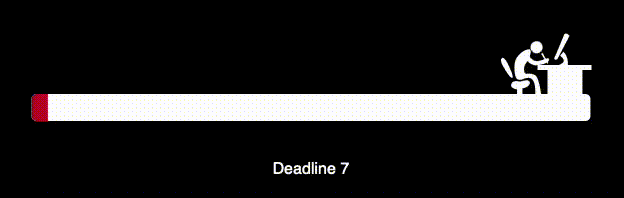

  

# 👋 Hi there, I'm **Albert Grabar**!  
Welcome to my GitHub profile! 🚀 I am a passionate web developer who loves building creative and efficient solutions.

---

## 🔧 **Languages and Tools:**

  

---

## 📈 **GitHub Stats:**

  

  

---

  

## 🌟 **Featured Projects:**

### 🎨 <a  href="https://grabar001.github.io/Portfolio/"  style="font-size: 2rem; color: #4CAF50; text-decoration: none;">Portfolio</a>
A modern portfolio website showcasing my work, built with:

  
  
  
  

---

  

---

## 📞 **Contact Me:**

  
  
  

